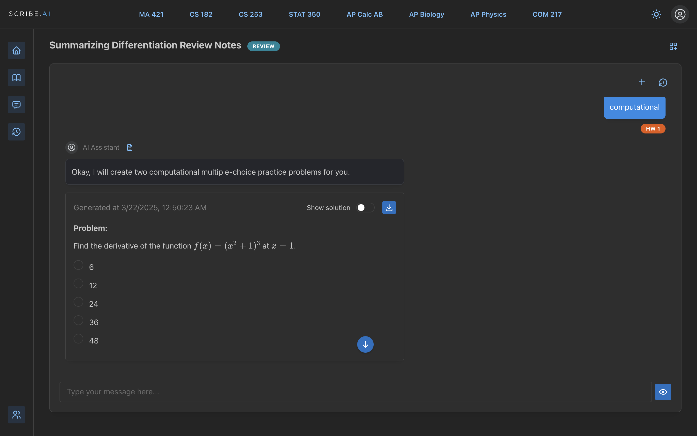
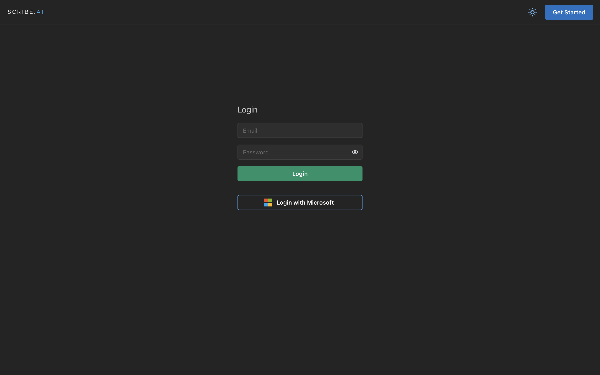
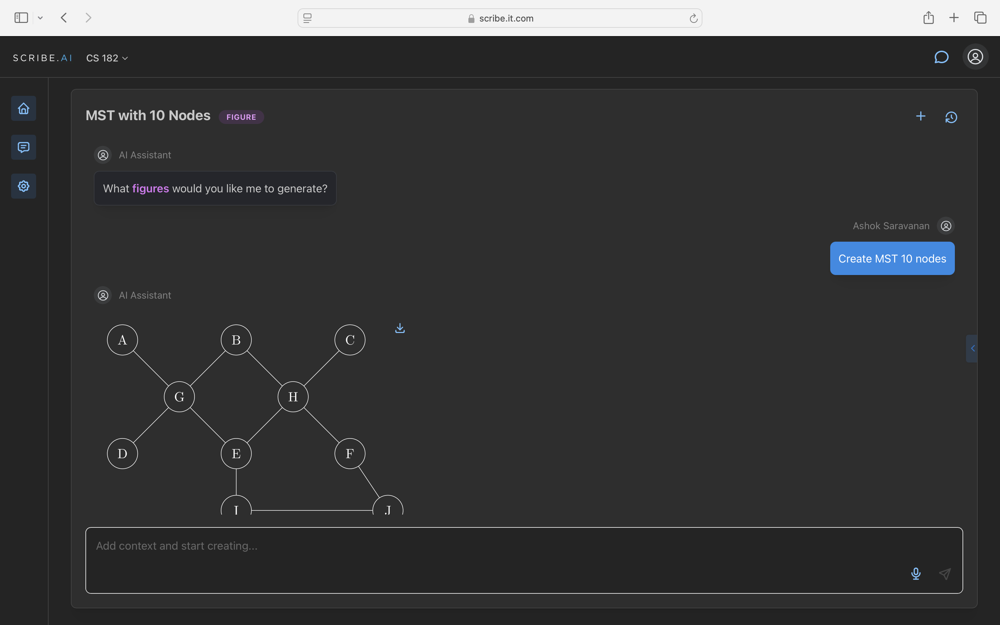

<p align="center">
  
</p>

<p align="center">
  <em>An interactive lecture viewer with AI assistants for every class.</em>
</p>

Scribe is a class-aware AI workspace. Students pick a course, drop in a
lecture (PDF, slides, recording), and chat with an AI assistant that
already knows the material — generating practice problems, visualizing
graphs and figures, explaining derivations, and reviewing notes. Sign
in with Microsoft (school email) and your enrolled classes show up
automatically.



## Demos

Short walkthroughs (most are under a minute). Full-quality copies are
in [`docs/`](./docs).

**Professor demo** — setting up a class, uploading material, configuring the assistant.

(drop the professor video here from docs/professor-demo.mp4)

**Student demo** — the day-to-day flow: open a class, ask the assistant, get a generated answer.

(drop the student video here from docs/student-demo.mp4)

**Exam mode** — generating practice problems and step-by-step solutions, with show/hide answer toggles.

(drop the exam video here from docs/exam.mp4)

**Analytics** — usage and engagement dashboards for instructors.

(drop the analytics video here from docs/analytics.mp4)

**Visualizations** — on-demand figure and graph generation (e.g. MST, derivations).

(drop the visual video here from docs/visual.mp4)

**Ready-made content** — pre-built study material that ships with each class.

(drop the ready-content video here from docs/ready-content.mp4)

**Privacy & security** — how lecture content and student data are handled.

(drop the secure video here from docs/secure.mp4)

**Developer mode** — building, configuring, and shipping new assistants.

(drop the develop video here from docs/develop.mp4)

## Screenshots

| Login (Microsoft SSO) | AI figure generation |
| --- | --- |
|  |  |

## What's in here

- **`client/`** — Next.js 15 (App Router) + TypeScript frontend. Mantine
  UI, Supabase Auth + DB, Microsoft Graph for school SSO, KaTeX for math
  rendering, TanStack Query/Virtual for data + virtualization.
- **`server/`** — FastAPI (Python 3.12) backend. PDF/document ingest,
  the assistant pipeline, file uploads, served via Gunicorn + Uvicorn.
- **`docker-compose.yml`** — orchestrates client, server, and nginx.
- **`nginx.conf`** — reverse proxy / TLS termination for prod.

## Quick start

```bash
# server (FastAPI, Python 3.12)
cd server
make sync         # creates .venv, installs deps via uv
make run          # http://localhost:8000

# client (Next.js)
cd client
yarn
yarn dev          # http://localhost:3000
```

Or `docker compose up` to bring up the full stack with nginx in front.

A `.env` is required (Supabase project URL/keys, Microsoft Graph app
credentials, OpenAI key for the assistant runtime). No template is
committed; ping the maintainer.

## Branches

- `main` — default, where reviewed work lands
- `prod` — what's deployed

## Authors

Built by [@asarv2 / Ashok Saravanan](https://github.com/asarv2) and
collaborators (see `git log`).
